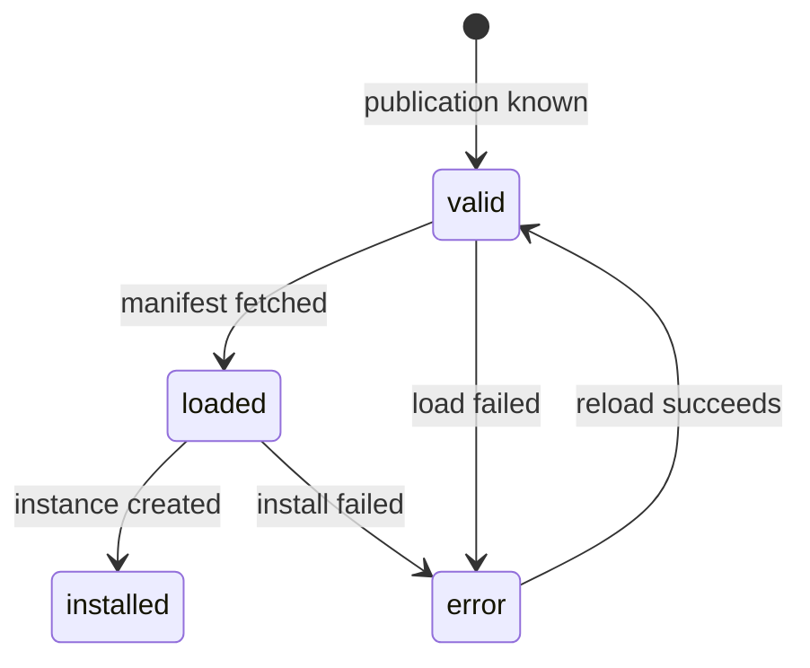
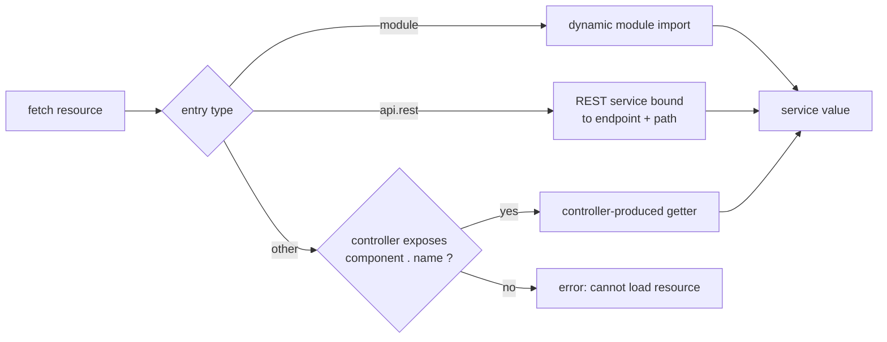

# Component Model — Specification

**Domain**: the component — the platform's unit of composition, distribution and
configuration.
**Owner**: `@jointhedots/core`. Consumed by every other package and by host applications.
**Boundaries**: how a service is wired *through* a component is covered by
[services.spec.md](services.spec.md); the value schemas referenced below are covered by
[schema.spec.md](schema.spec.md); UI flows over components are covered by
[ui-shell.spec.md](ui-shell.spec.md).

## The component

A **component** is an addressable unit that publishes typed services. It has two faces:
a *publication* (its searchable identity card, indexed in catalogs) and a *manifest*
(its persisted definition, loaded on demand). Code is never described inside a manifest —
code is referenced through resource entries and resolved at load time.

A component is identified by a **ComponentID**: a colon-namespaced string `ns:name`.
An id without a colon belongs to the default namespace `std`; an id starting with a
colon belongs to the empty namespace. The namespace part drives grouping in catalogs.
Well-known namespaces: `jtd` (platform components), `config` (user-created
configurations), `log` (platform services such as the application logger).

## The manifest

A **ComponentManifest** is the persisted definition of one component instance:

- `$id` — the unique id of this instance.
- `type` — the ComponentID of its **controller** component.
- metadata — `title`, `icon`, `description`, `keywords`, `tags`, `doc`.
- `specs` — per-service value schemas (what each service accepts/produces).
- `apis` — per-service **resource entries** (how each service's code is reached).
- `data` — the type-specific payload interpreted by the controller.

A manifest is data. The same controller can back any number of manifest instances, each
differing by `data` and `specs` — this is the configuration pattern of the platform
(e.g. one GitHub service component, many repository configurations).

## The controller

The component designated by a manifest's `type` is its **controller**. The controller
owns the manifest lifecycle: it creates new manifests, updates existing ones, and checks
them. **Checking** produces a list of issues at three levels — `error`, `warn`, `info` —
each optionally carrying an executable fix. The controller also exposes an **editor
contract** (a creator, an editor, an optional preview) that UIs use to edit manifests of
its type, and a **component schema** describing its editable attributes.

## The publication

A **ComponentPublication** is the searchable card of a component: `id`, `ref`, `type`,
`title`, `icon`, `description`, `services`, `keywords`, `tags`. It is derived from the
manifest, merged with the services exposed by the controller itself. Publications are
what catalogs index and what searches return; manifests are what gets loaded and edited.
A **ComponentFilter** queries catalogs on any combination of: `query`, `pattern`,
`keywords`, `tags`, `types`, `services`.

## Registry lifecycle

The registry manipulates components through a runtime handle, the **ComponentEntry**:

- **valid** — the publication is known; the component can be listed and searched.
- **loaded** — the manifest has been fetched; specs, apis and metadata are readable.
- **installed** — the component instance exists and services can be resolved.

Invariants of the lifecycle:

- A component instance is always an object; anything else is rejected.
- The manifest of a component is readable only once loaded.
- Load and install are single-flight: concurrent requests for the same component share
  one operation and one outcome.
- A failed load never disappears: the component is preserved as an **error component** —
  a pseudo-manifest of type `<error>` carrying the failure message (and stack when
  available). Error components remain visible in the registry, are excluded from
  *valid* results, and are rendered as data by consumers rather than raised as
  exceptions.

A **ComponentResource** is one named api slot of a component. Fetching a resource
resolves the value the slot designates (see below).

## Resource resolution

Each manifest api slot holds a **ResourceEntry** — a typed pointer
(`type`, `location`, `identifier`). Resolution order:

Any entry type outside this table is an error. Resources addressed with a dotted path
(`view.react`) designate a subservice slot.

## Providers

The registry draws publications and manifests from **providers**. The platform defines
four provider roles:

- **Static provider** — catalogs and manifests published by build artifacts (the bundle
  manifest of each built package).
- **Local provider** — components created and persisted by the user in the browser.
- **In-memory provider** — components published programmatically at runtime.
- **Combined provider** — a chain over other providers, first-wins: the first provider
  answering non-null wins the query.

The provider contract is uniform: search publications, get/set a manifest,
add/delete a component.

## Bundles

A **BundleManifest** is a manifest of type `bundle` describing a *built package*: its
`alias`, `package` name, baseline `version`, `namespaces`, `dependencies`,
`distribueds` (peer packages redistributed for consumers, e.g. React), `exports`, and
`components` — the catalog of components the package publishes. The bundle manifest is
the bridge between the packaging world (see [packaging.spec.md](packaging.spec.md)) and
the component world: it is what a static provider serves.

## Persisted and exchanged data

Persisted: manifests (in the local provider's store and in bundle artifacts),
publications (in catalogs). Exchanged across the network: manifest JSON, publication
JSON, and the modules fetched through resource entries. Nothing else about a component
leaves the registry.
