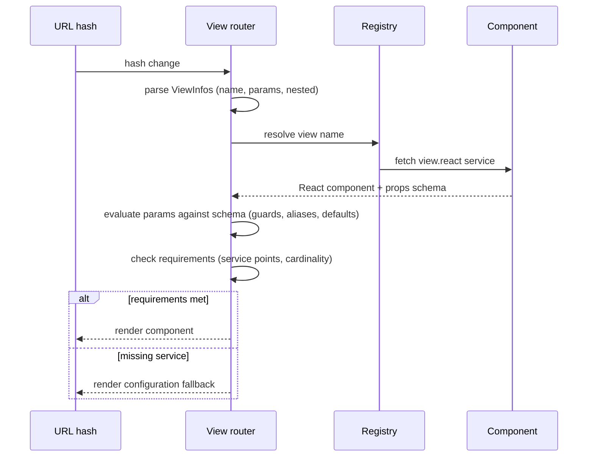

# Standard Interfaces — Specification

**Domain**: the standardized integration facets of the platform — commands, versioned
storage, view routing, REST, and the React view bindings.
**Owner**: `@jointhedots/core`. Each facet is a service interface (see
[services.spec.md](services.spec.md)) that components implement or consume.

## Commands

A **Command** is the platform's executable envelope: a `target` URI of the form
`command://<component><path>`, a `payload`, presentation metadata (icon, title,
summary), and security fields (`identity`, `signature`). A **Cmdlet** is a command
handler: payload in, result out, both serializable. Commands are dispatched by target:
the component is resolved and the path routed to its commands service.

**Named limit**: `identity` and `signature` are declared but not validated — command
execution currently trusts its caller. Authentication of commands is an open question,
not a guarantee.

## Versioned storage

The **StorageService** contract is a file store with full history: `list`, `stats`,
`read`, `write`, `recall` (read a past state), `commit`, plus changeset inspection
(`getChangeSet`, `getChangeLog`, `getFileLog`). Every write is a **FilePatch** by an
**Author**; patches compose into **changesets** identified by id, and the store can
walk back through them (time travel).

The core package ships the *contract only* — storage implementations are components
(e.g. a Git-backed storage service) wired through service points.

## View routing

A **view** is a named, parameterized render target. The **ViewInfos** describe one view
invocation: `name`, `params`, `content`, and an optional `nested` view chain. Views are
addressed in the URL hash as `#name?params/nestedName?nestedParams`, so any view state
is a shareable link.

Parameter evaluation applies the schema system (see
[schema.spec.md](schema.spec.md)): alias remapping, security guards per property,
content binding, and default fallback. A view name resolves to the component exposing
the `view.react` service under that name.

## REST

A **RESTService** is an HTTP service bound to an `endpoint` and a `path`. The `jtd:`
URI scheme routes a call to a component's own REST service: `jtd:` addresses stay
inside the platform while delegating transport to plain HTTP. REST fetching is the only
generic networking primitive of the platform; components may expose one as a service.

## React bindings

The **view.react** service specification is the platform's rendering contract: a React
component together with the schema of its props. A parallel web-component key exists for
framework-agnostic rendering.

On top of it, the React bindings provide: URL-driven view invocation (hash change →
resolved view), nested view stacks, per-view requirements with cardinality (see
[services.spec.md](services.spec.md)), async state helpers for loading/using
asynchronous values, and a registry of **error displayers** so any error type can get a
dedicated rendering.

### View resolution flow

