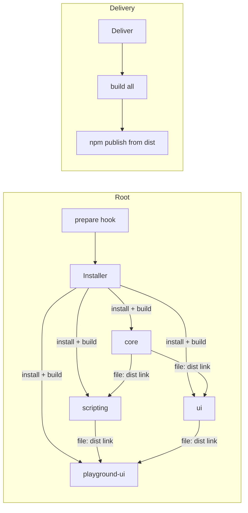

# Packaging & Delivery — Specification

**Domain**: how the platform's libraries are declared, built, linked, published and
demonstrated.
**Scope**: the meta-repository organization, the export declaration contract, the build
artifact, and the delivery flow. Operational how-tos live in the repository README.

## Meta-repository

The repository is a **meta-repo of independent package projects**: three libraries
(`@jointhedots/core`, `@jointhedots/ui`, `@jointhedots/scripting`) and playground
applications, each with its own dependency install. There is no workspace: packages are
linked to each other through `file:` dependencies pointing at the **built outputs** of
their dependencies. Consequence: build order is part of the contract —
`core` first, then `scripting` and `ui`, then playgrounds.

Registration is explicit: a package participates in installation and delivery only if
listed in the corresponding root flows.

## Export declaration

Each library declares its public surface — the subpath export map from export name to
source entry — in its `declaration.json`, which is the input contract of the build
tool. The declaration also carries the package's namespace registrations and the list
of peer packages redistributed to consumers.

Versioning rule: source packages carry a placeholder version; **published bundles carry
the repository root version**, stamped at build time. The root version is the single
version of a delivery.

## Build artifact

The build of a library produces, under `dist/<library>`, a **self-contained publishable
package**: one content-hashed ESM chunk per declared export plus shared chunks,
generated type declarations, a package.json materializing the export map, and a
**bundle manifest** — a component manifest of type `bundle` (see
[components.spec.md](components.spec.md)) whose catalog is the static component
provider's data source.

Packages marked `singleton` are deduplicated to a single copy when hosts bundle them —
runtime singletons (registries, settings) rely on this.

## Delivery

Delivery publishes the **built package**, never the source: publish from
`dist/<library>` to the public npm registry. Two equivalent paths: per-library
`deliver` (build then publish), or the root delivery flow (build all registered
libraries, then publish each).

## Installation

Installing the repository runs, per registered package: clone or pull if the package
has a remote source, verify presence otherwise; install dependencies; build. The root
install flow is triggered automatically by the package-manager prepare hook, so a plain
install at the root bootstraps everything.

## Playgrounds

Playgrounds are host applications consuming the libraries — they are the demonstration
and smoke-test surface of the platform. The **web playground** is a browser application
served by the build tool's dev server, with one sample page per platform capability
(panels, text templates, icons, layouts, inputs, services wiring end-to-end). The
**chrome extension playground** is experimental and not part of the default install.

## Environment requirements

A pinned package manager version; a modern Node runtime (ES2022 targets); Deno for the
scripting test suite; and a sibling checkout of the design-system repository
(`jointhedots-ui`) supplying the `@jointhedots/button`, `input`, `layout`, `icon` and
`theme` packages through file-path overrides.
