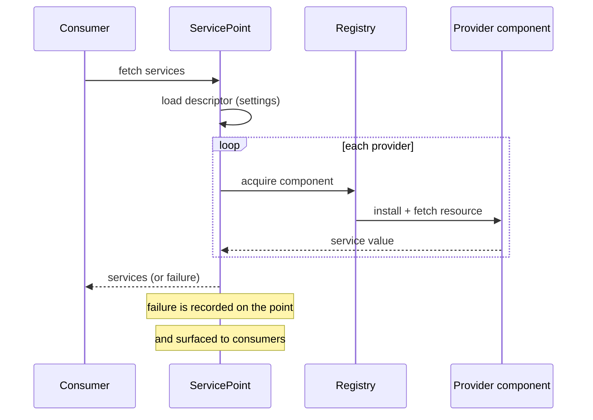

# Service Model — Specification

**Domain**: typed, version-checked wiring between service consumers and service
providers.
**Owner**: `@jointhedots/core`. Built on the component model
([components.spec.md](components.spec.md)); consumed by the UI shell
([ui-shell.spec.md](ui-shell.spec.md)) and by host applications.

## Services

A **service** is a standardized feature interface: storage, commands, a React view, a
REST endpoint. A service is *produced* by a component resource and *consumed* through a
connection point; neither side knows the other.

A **ServiceSpecification** declares a service interface: its `$spec` URI (the identity
of the interface), its `version`, an optional JSON `schema` of the values exchanged, a
`category`, `tags`, and a `minCompatibleVersion` floor. A **ServiceDefinition** is the
implementation-side reference: the `$spec` it implements, at which `version`, with which
properties. A **ServiceAccessor** is the typed handle binding a service name to a
component resource; it supports subservice paths (`view.react`) for composite services.

### Version compatibility

A definition satisfies a specification when: the `$spec` URIs are exactly equal, the
major versions match, and the provider's minor version is greater than or equal to the
required one. `minCompatibleVersion` sets an absolute floor. A provider *newer* than
required (higher minor) is accepted with a warning. Anything else — different `$spec`,
different major, older minor, below the floor — is incompatible, with a reason.

## Service points

A **ServicePoint** is a global connection point for one named requirement: consumers ask
the point for the service; the point resolves it from the components designated as
providers. Points are identified as `<service>/<name>` (e.g. `storage/sources`).

The wiring of a point is described by a descriptor, the **ServicePointSetting**:

- `id` — the point identifier.
- `providers` — the ordered list of ComponentIDs providing the service.
- `properties` — `title`, `multiple` (several providers allowed), `alternative`
  (another point that can satisfy the same need).

Descriptors are persisted in the settings group `service_points` (one entry per point),
so wiring survives sessions and can be edited by users.

### Resolution

Resolution failures are recorded on the point itself rather than thrown: consumers read
the point's state and render it (spinner, error, configuration fallback).

### Propagation

- A change in the `service_points` settings group resets the affected points and
  re-resolves them.
- An update of a component notifies every point that lists it as provider.
- A point can be **overridden** for the current session only (temporary wiring, not
  persisted) and reset back to its persisted descriptor.

## Settings

The **AccountSettings** store is the persisted home of user wiring. It holds three
groups — `service_points`, `components`, `shareds` — in named stores (default `default`)
persisted locally and synchronized across tabs of the same browser.

Write discipline: a **Default** write persists; a **Temporary** write shadows the
persisted value for the session; a **Reset** drops the temporary shadow. A write that
changes nothing is a no-op and notifies nobody.

## React consumption

Views declare **requirements**: the service points they need, with a cardinality
(minimum number of services). Rendering enforces it — fewer resolved services than the
cardinality raises a missing-service error that the shell turns into a configuration
fallback rather than a crash. Consumers subscribe to a point and re-render when its
resolution changes.
