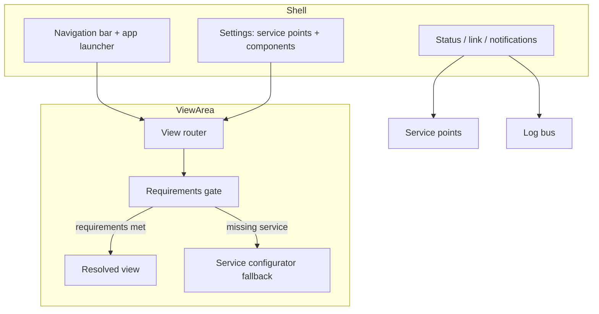

# UI Shell — Specification

**Domain**: the generic application shell and administrative UIs of the platform.
**Owner**: `@jointhedots/ui`. A pure consumer of the core runtime
([components.spec.md](components.spec.md), [services.spec.md](services.spec.md),
[interfaces.spec.md](interfaces.spec.md)) — the shell performs **no networking and no
persistence of its own**: everything transits the component registry, the settings
store, the log bus and the view router.

## Application shell

An application is described by an **AppDescriptor**: `title`, a tree of **AppPages**
(each with icon, view, description, and nested pages), a `landingPage`, `toolings`, and
`requirements` (the service points the app needs, with cardinality).

The **ApplicationBoard** renders the shell: a navigation bar with the page menu, an app
launcher, a tooling area, and the view area driven by hash routing (see
[interfaces.spec.md](interfaces.spec.md)). The view named `settings` is reserved for
the board's own settings page, which exposes two surfaces: service point wiring and
component management.

**Toolings** are shell widgets anchored to the status area or the menu: a service point
status, a link (URL or view), the notifications bell.

The **ApplicationSelector** is the landing screen when no application is active: it
lists installed applications — components of the application-board type exposing a
React view — and launches one.

## Components library

The administrative surface over the component model:

- **Browser** — search and filter publications (query, keywords, tags, types,
  services), grouped by namespace; each item offers inspect, edit and delete actions.
- **Creation flow** — pick a controller type from the catalog of drivers, fill the
  creator form, save; the new manifest is persisted through the registry.
- **Editor** — the controller's own editor when it provides one; otherwise a default
  form generated from the component schema; plus a read-only JSON view of the manifest.
  Checking issues are displayed inline with their level, and executable fixes can be
  applied.
- **Info card** — the controller's preview of a component, with the notifications
  scoped to that component.

## Service point UI

- **Status** — a chip reflecting a point's resolution state (loading, failed, ok).
- **Connexion selection** — for a point, pick provider components among all components
  exposing the service; missing providers are surfaced explicitly instead of hidden.
- **Editable connexions** — change the provider list, with session-only overrides
  (temporary wiring) possible alongside persisted ones.
- **Missing-service boundary** — when a view or app fails to render because a required
  service is missing, the error is caught and replaced by the **service configurator**:
  a form to wire the missing point on the spot. The fallback is registered once at
  application initialization.

## Notifications

The notification center reads the platform log bus and splits it into two sections:
**tickets** (open issues with lifecycle — open, closed, success) and **events**
(transient records). Each entry carries its status, icon, message and **actions** —
commands (see [interfaces.spec.md](interfaces.spec.md)) rendered as buttons and
executed on click. Lists paginate by count and can be scoped to a subject (e.g. one
component).

## Dialogs and editors

- **Dialogs** — a yes/no question dialog, and a schema-driven data-entry dialog (a form
  generated from any schema).
- **Code editor** — a Monaco-based editor component with pluggable language providers
  (context attachment, model checking); it is also published as a component exposing
  the Monaco worker services, so hosts load editor workers through the component model
  like any other service.

## Composition

